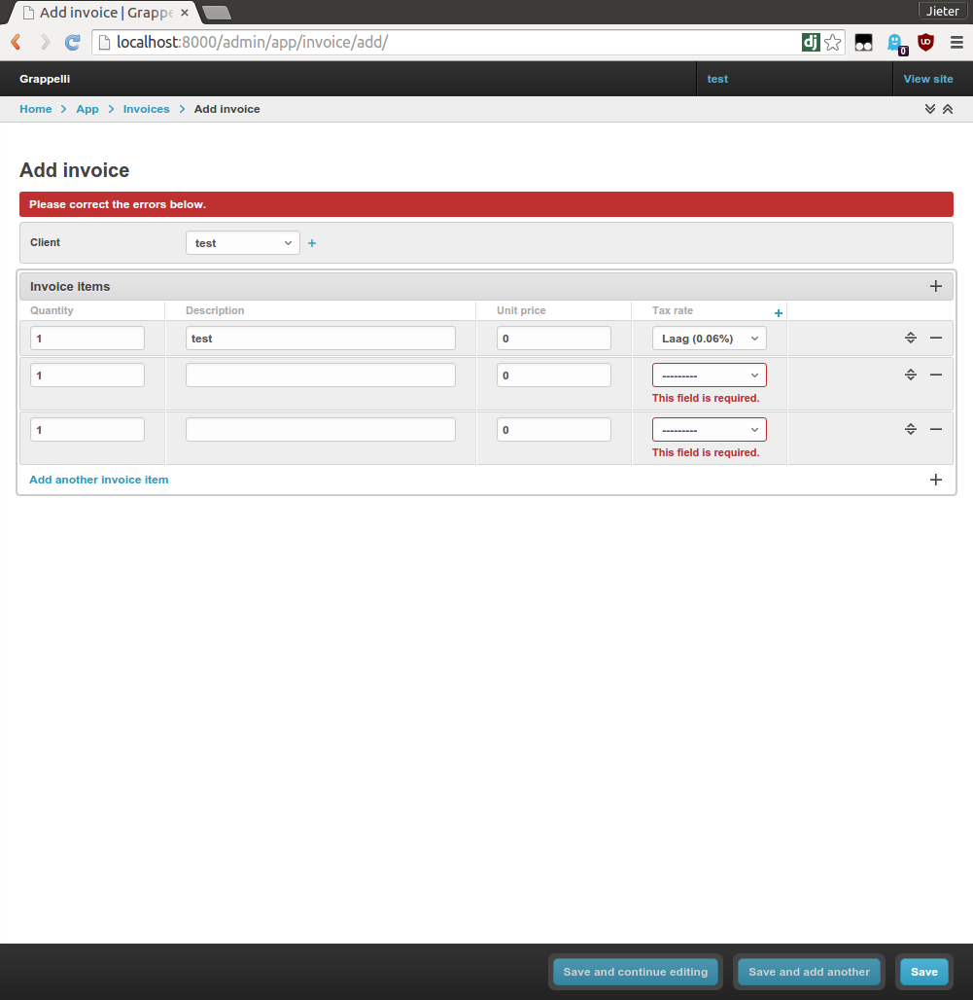

# grappelli inlines validation example


```
# make virtual environment
pip install -r requirements
./manage.py runserver
```

Go to http://localhost/admin/
username: test
password: test

Try to add an invoice with one row.


